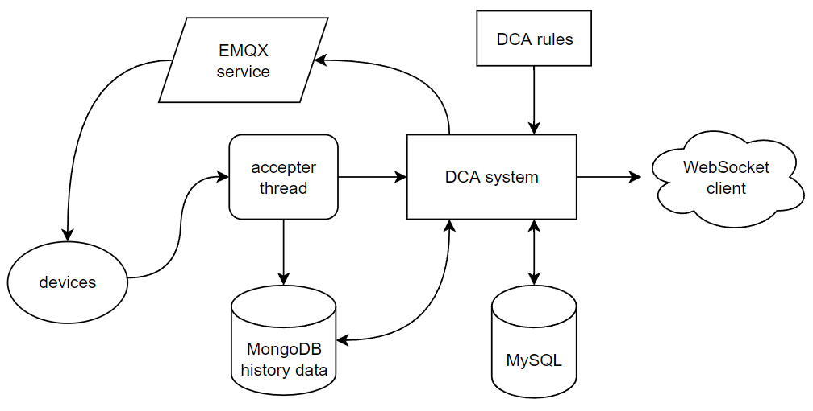

# DCA IOT system

# Introduction

DCA IoT System is a rule-based device monitoring and message processing system. 

And this is also a prototype system of [*An Adaptable IoT Rule Engine Framework for Dataflow Monitoring and Control Strategies*](An_Adaptable_IoT_Rule_Engine_Framework_for_Dataflow_Monitoring_and_Control_Strategies.pdf).

## Features

- Make decision by writing DCA rules.
- Allow for writing multi-devices rules.
- Easy to use.
- Allow for sharing device data among users.

## Outline
- [DCA IOT system](#dca-iot-system)
- [Introduction](#introduction)
  - [Features](#features)
  - [Outline](#outline)
- [Quick Start](#quick-start)
  - [Requirements](#requirements)
  - [Installation](#installation)
  - [Basic Use](#basic-use)
- [Documentation](#documentation)
  - [Rules For Testing](#rules-for-testing)
  - [Architecture](#architecture)
  - [Key Concepts](#key-concepts)
  - [Expand DCA Rule](#expand-dca-rule)
    - [Rule Syntax](#rule-syntax)
    - [Message Accepter](#message-accepter)
    - [Rule Matcher](#rule-matcher)
    - [Action Executor](#action-executor)
  - [WebSocket Connector](#websocket-connector)


# Quick Start

## Requirements

[MySQL service](#https://www.mysql.com) and [EMQX service](#https://www.emqx.io/) is required to running this system.

- Deploy MySQL service 
- Deploy EMQX service

[Go](#https://go.dev/) version: 1.18.1

Install [python](#https://www.python.org/) if you'd like to use the testing message sender script.

## Installation

1. Clone this project

```shell
git clone https://github.com/ChenKen9869/DCA-IOT-system.git
```

2. Build it locally

```shell
cd DCA-IOT-system
go build -o ./build/dca
```

3. Config the project at /config/application.yaml

```shell
vim ./config/application.yaml
```

**Deploy this project in server**

1. Use scp command to send the executable file to the server.

   ```shell
   scp ./build/dca another-server-directory
   ```

2. Use [go-swagger](#https://github.com/go-swagger/go-swagger) to generate the swagger api file. And also use scp command to send swagger files to the server.

   ```shell
   swag init
   scp -r ./docs another-server-directory
   ```

3. Use scp command to send the config file to the server

   ```shell
   scp ./config/application.yaml another-server-directory/config/
   ```

4. Use scp command to send the example device python file to the server for testing rules

   ```shell
   scp ./scripts/example_device.py another-server-directory/scripts/
   ```

5.  Start the service

   ```shell
   ./dca
   ```

## Basic Use

After deployed and started service, test the system by using swagger api webpage : <http://localhost:5930/swagger/index.html#/>

1. Create an account: **[[POST]/user/register](#http://localhost:5930/swagger/index.html#/User/post_user_register)**, this api will return "token". 

   Copy "token", and put "Bearer " before it. 

   Paste the "token" with "Bearer " into "Authorization" header when visit other api.

2. Create a company: **[[POST]/company/create](#http://localhost:5930/swagger/index.html#/Company/post_company_create)**

3. Create a biology: **[[POST]/biology/create](#http://localhost:5930/swagger/index.html#/Biology/post_biology_create)**

4. Create a Portable Device or a Fixed Device: **[[POST]/device/portable/create](#http://localhost:5930/swagger/index.html#/Device-portable/post_device_portable_create)** or **[[POST]/device/fixed/create](#http://localhost:5930/swagger/index.html#/Device-fixed/post_device_fixed_create)**

   Remember the device id, so you can use it in 5.

5. Create a DCA rule: **[[POST]/rule/create](#http://localhost:5930/swagger/index.html#/Rule/post_rule_create)**

   For example, you just created a portable device for id = 1. And the device is collar device which message has the attribute "temperature". 

   If you'd like to monitor this device and control the temperature of farmhouse by send command to the MQTT topic "command", you should write DCA rule such like this:

   **Datasource:** 

   ```
   tem{1, Portable, temperature}
   ```

   **Condition:**

   ```
   tem > 22
   ```

   **Action:**

   ```
   WebSocket: 1,rule Matched, temperature is $tem!;Mqtt: localhost, 1883, admin, emqx@123456, command, open the electric fan
   ```

6. Use websocket client to **connect to the monitor center** by visit below url.

   ```
   ws//locallhost:5930/monitorCenter/connect
   ```

   **Do not** use swagger to direct visit this api. 

   If you want to disconnect with service, use **[[DELETE]/monitorCenter/disconnect](#http://localhost:5930/swagger/index.html#/MonitorCenter/delete_monitorCenter_disconnect)**, or just close the websocket client.

7. Use MQTT client to listen the command **topic "command"** and get the message send by DCA runtime object. 

8. Start the DCA rule: **[[GET]/rule/start](#http://localhost:5930/swagger/index.html#/Rule/get_rule_start)**

9. Run test python script to send data to the system. This script simulate sensor data.

   ```shell
   python ./script/example_device.py
   ```

   And send the following test message to the system.

   ```
   0000001, collar, temperature, 25.6
   ```

   - "0000001" stands for device id; 
   - "collar" stands for device type; 
   - "temperature" stands for message attribution; 
   - "25.6" stands for current data of attribution "temperature". 

   You can change the data in this message form. But when you do this, **change the device's information and rule description at the same time.**

10. Waite a moment, you should find message in your WebSocket client and command in MQTT topic "command".

11. When finish testing, remember to end the rule: **[[GET]/rule/end](#http://localhost:5930/swagger/index.html#/Rule/get_rule_end)**

    If you just close the service without end the rule, you should **change the rule's status in MySQL manually**. 

    ```sql
    UPDATE rules SET stat='Inactive' WHERE id=id_of_the_test_rule;
    ```

    If rule's status equals "Active" of "Scheduled", error will occur when you start or schedule the rule in the next time.

# Documentation

**Get more information about REST APIs that the system offers at [Swagger UI webpage](http://localhost:5930/swagger/index.html#/) when the system has been deployed.**

## Rules For Testing

Use  **[[POST]/rule/create](#http://localhost:5930/swagger/index.html#/Rule/post_rule_create)** to create and test more rules. Remember to create devices first. And you should also change the payload of messages send by the test python script.

Here are some of the basic test cases we provide:

**1. Verify single device rule with expression condition and multi actions**

Rule1:

**Datasource:** 

```
tem{1, Portable, temperature}
```

**Condition:**

```
tem > 22.3
```

**Action:**

```
WebSocket: 1,rule Matched, temperature is $tem!;Mqtt: localhost, 1883, admin, emqx@123456, command, open the electric fan
```

**2. Verify multi-device linkage rule with expression condition and multi actions**

Rule2:

**Datasource:** 

```
tem_1{1, Portable, temperature}; tem_2{1, Fixed, temperature}
```

**Condition:**

```
(tem_2 > 25.3) & (tenm_1 > tem_2 +3 )
```

**Action:**

```
WebSocket: 1,rule Matched, temperature is \$tem_2 and $tem_1!;Mqtt: localhost, 1883, admin, emqx@123456, command, open fan
```

**3. Verify functional condition with multi acitons**

Rule3:

**Datasource:** 

```
longitude{1, Portable, longitude}; latitude{1, Portable, latitude}
```

**Condition:**

```
PointSurface: longitude, latitude, 1xx.40xxx2, 3x.92xx55, xx6.4xx70x, xx.89xx55, 1xx.40xx92, x9.8xx353, xxx.38xx46, xx.89x365
```

**Action:**

```
WebSocket: 1,rule Matched, position is \$longitude $longitude!;Mqtt: localhost, 1883, admin, emqx@123456, command, find device
```

The function of the PointSurface functional condition used in Rule 3 is to determine whether a point is in a surface. We use this rule to determine if the target device is in the given range. Starting from the third parameter and working backwards, we fill in the longitude coordinates and latitude coordinates of the points that enclose the polygon of the given range (the coordinate points are taken from the Amap API). In order to protect privacy, we have blurred the specific coordinate points in the test cases, using x instead of some numbers.

**4. Verify multi rules concurrent running**

In order to test whether multiple rules run concurrently to get the expected results,  testing Rule 1, Rule 2, and Rule 3 concurrently using the four REST API interfaces of the scheduling rules.

## Architecture

The system is made up by following architecture.



## Key Concepts

- **User**
  - The account belongs to one certain user.
- **Manager & Visitor**
  - A user could become a manager or a visitor of certain company.
  - Manager could change the entities of company, such as biology, device, or rule.
  - Visitor only has read auth to entities.
- **Company & Owner**
  - One User create a company, and he/she becomes the owner of this company.
  - Company's owner is able to grant auth to other users (make them become manger or visitor)
- **Biology**
  - Biology is belong to a certain company, and its owner is the company's owner
- **Device**
  - Device is divided into portable device and fixed device.
  - Portable device is bound with certain biology, its owner is the biology's owner.
  - Fixed device is belong to a certain company, and its owner is the company's owner.
- **Rule**
  - Only manger and owner can create/start/end/schedule rule of a company.
  - And only devices that belong to the company could be defined as datasource in DCA rules.
  - Auth check will happen in creating rules, it will check if the user has auth permission to the company, and also if devices all belong to the company.

## Expand DCA Rule

### Rule Syntax

Datasource syntax: 

​		**Name{id, type, attribute}; Name{id, type, attribute}**
Condition syntax: 

​		**Expression of Name**

​		or 

​		**TypeSymbol: { params list contains Name split by "," }**

Action syntax: 

​		**ActionType: { params list contains \$Name split by "," }; ActionType: { params list contains \$Name split by "," }**

### Message Accepter

This section is about how to create new message accepter.

1. Accept & parse message

   You should transform device_id and device_type of message into id and device_type in MySQL.

   For example:

   **Message: 0000001, collar, temperature, 25.6**

   - In this message, collar means it is from a portable device. 
   - You should use "0000001" and "collar" as condition to select id from MySQL table "portable_devices".
   - After this, as shown in 2, use id and device_type "Portable" to update datasource management.

2. Update datasource management by below function

   ```go
   package accepter
   
   func updateDatasourceManagement(id int, deviceType string, attr string, value float64)
   ```

3. Save data into MongoDB if you need.

### Rule Matcher

This section is about how to create new **function condition rules**.

Function condition rules are defined as below format:

```
FunctionConditionType: val_01, val_02, const_01, const_02, const_03, const_04
```

Such as: 

```
PointSurface: val_01, val_02, const_01, const_02, const_03, const_04
```

1. Create new **matcher function**

   Matcher function should define as this format: 

   ```go
   func MatcherFunction(tokenList []ruleparser.Token, innerTable ruleparser.InnerTable) bool 
   ```

   It should take a **ruleparser.Token** list type and an **ruleparser.InnerTable** type variable as input. And the output type must be bool. 

   ```go
   package ruleparser
   
   type Token struct {
   	TokenType  string
   	TokenValue string
   	RealNum    float64
   }
   
   type InnerTable = map[string]float64
   ```

   All symbol which can be found in innerTable will be parsed as **value token**. Other symbols will be parsed as **str token**.

   This means the Token.TokenType is either **ValTokenType** or **StrTokenType**.

   ```go
   package ruleparser
   
   var ValTokenType string = "VAL"
   var StrTokenType string = "STR"
   ```

   For value token, you can use its **Token.TokenValue** attribution to find current data of this symbol in the **innerTable**. 

   For example:

   ```go
   if tokenList[0].TokenType == ruleparser.ValTokenType {
   	for symbol, value := range innerTable {
   		if symbol == tokenList[0].TokenValue {
   			tokenList[0].RealNum = value
   			break
   		}
   	} 
   }
   ```

2. Create the function **condition type symbol**, such as **"ConditionType"**.

   ```go
   package ruleparser
   
   var ConditionType string = "SymbolOfFunctionConditionType" 
   ```

3. Initial it in **api/rule/init.go**

   Push the new matcher function into **ruleparser.MatcherMap**. Use condition type symbol as index:

   ```go
   package rule
   
   func InitRule() {
   	... ...
   	ruleparser.MatcherMap[ConditionType] = MatcherFunction
   	... ...
   }
   ```

### Action Executor

This section is about how to create action executor.

1. create executor function and it's param channel

   ```go
   package actions
   
   var NewActionChannel chan (string)
   
   func ExecNewAction(params string)
   ```

2. define the params list and the parse function.

   ```go
   package actions
   
   const (
   	WebsocketActionType string = "WebSocket"
   	MqttActionType      string = "Mqtt"
       ... ...
       NewActionType		string = "NewActionTypeSymbol"
   )
   ```

   And register it into **actiona.ActionChannels** in /api/rule/init.go.

   ```go
   package rule
   
   func InitRule() {
       ... ...
       actions.NewActionChannel = make(chan string)
       actions.ActionChannels[actions.NewActionType] = actions.NewActionChannel
   }
   ```

3. initial it in api/rule/actions/init.go

   Put the new action executor function and param channel in function **StartActionExecutor**: 

   ```go
   package actions
   
   func StartActionExecutor() {
   	for {
   		select {
   		... ...
           case params := <-NewActionChannel:
               gopool.Go(func() {
                   ExecNewAction(params)
               })    
   		}
   	}
   }
   ```

## WebSocket Connector

Use the message channel inside the system to push message to any user

```go
var message string = "hello!!!"

// make sure target user has connected with monitor center
ch, exist := monitor.MonitorCenter[userId]
if exist {
	ch.MessageChan <- message
}
```

If the target user has connected with monitor center, then the message will be send to the WebSocket client.
